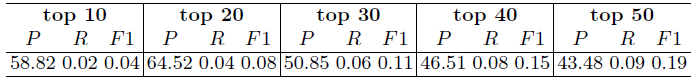
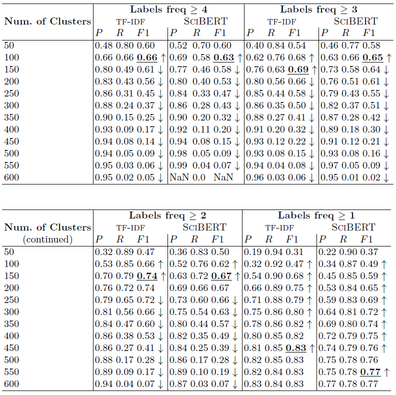

## The ORKG-Assays Microservice - Digitalization of Bioassays in the Open Research Knowledge Graph

#### This repository hosts supplementary data to the following publication

Jennifer D'Souza, Anita Monteverdi, Muhammad Haris, Marco Anteghini, Kheir Eddine Farfar, Markus Stocker, Vitor AP Santos, and Sören Auer. [The Digitalization of Bioassays in the Open Research Knowledge Graph](https://arxiv.org/abs/2203.14574). arXiv preprint arXiv:2203.14574 (2022). The citation for our accepted paper in the DeXa 2022 proceedings is forthcoming.

### Why Digitalize Bioassays? Motivating usecases.

A biochemist wants to compare existing bioassays that have been historically performed on the SARS virus. 
Assuming the availability of bioassays represented as machine-readable logical triple statements, 
a survey over the digitalized assay KG data can, in fact, be directly computed. 
Concretely, see https://www.orkg.org/orkg/comparison/R161302/ as a survey of 
six bioassays computed over the open research knowledge graph of bioassays in the [ORKG platform frontend](https://www.orkg.org/). 
Note that such an information access mechanism not only directly addresses the information need of the biochemist but also alleviates their effort 
to otherwise have to sift through volumes of unstructured bioassay descriptions to spot the key information. 
Specifically, taking advantage of the [ORKG](https://www.orkg.org/), the biochemist could even dynamically compute other tailored surveys to meet their information need. 
E.g., they might want to gain a comprehensive view only of those bioassays for molecules tested for the SARS virus which did not elicit a significant effect against the pathology. 
From the insights in such a dynamically computed view, they can consequently avoid testing the same molecule again, 
while focusing their attention on discovering more effective molecules. 
As another example, by having an expansive view on the various bioassays already tested in the literature, 
it should be possible to easily choose whether to repeat the experiments reproducing the same conditions of another research group 
or to try a new way to test compounds efficacy changing the type of bioassay or the type of cell cultures.

Taking a broader vision, _experiment silos_ are a problem frequently raised in research 
and a comparison of experimental models among research groups is not so frequent. 
In the context of the proposed work over bioassays, the ORKG digitalization service alleviates this problem of experimental silos by connecting all bioassays in its scholarly knowledge graph. 
Such KGs makes the bioassay data precisely _findable_ in accord with the [FAIR standards](https://www.go-fair.org/fair-principles/) advocated for research information. 
Overall, this could lead to a considerable minimization of time in research --- important especially during emergencies such as the 2019 coronavirus pandemic owing to the Sars-Cov-2 virus.

### About

ORKG-Assays is a freely available AI micro-service in ORKG written in Python designed to assist scientists obtain semantified bioassays as a set of triples. 
It uses an AI-based clustering algorithm which on gold-standard evaluations over 900 bioassays with 5,514 unique property-value pairs for 103 predicates shows competitive performance.

#### Detailed Experimental Results

   Table 1: Percentage bioassay semantification results by the naive method of most frequent labels assignment  

   Table 2: Bioassay semantification results by K-means clustering of bioassay vectorized representations  

The empirical results are presented in Tables 1 and 2, and discussed below in detail under three research questions (_*RQs*_).

_*RQ 1*: Is semantification by the top-n statements an effective method?_ 
In each of the five main columns in Table 1, viz. 'top 10' through 'top 50,' 
n corresponds to the number of the most frequent statements assigned for each assay. 
E.g., 'top 10' is the 10 most common statements; 
'top 50' is the 50 common statements. 
The results show that an increase in the number of statements ('n') for semantification insignificantly increases recall but at a significant cost to precision. 
In light of this, we asked ourselves: _could the naive method achieve greater than 50% F1?_ The answer is no. 
For this to occur either _P_ or _R_ has to cross the 50% threshold while the other value be close enough to average to a 50% _F1_. 
But the results show that this is certainly unlikely, since the highest recall of 0.09% ('top 50' column in Table 1) is achieved at 43.48% precision 
which is only steadily declining having achieved a peak value of 64.52% at 'top 20' statements. 
Thus, the semantification task cannot be solved by the naive method since it cannot handle the semantification pattern variations across bioassays, proved for those in our dataset.

_*RQ 2*: Is clustering suitable for bioassay semantification?_ 
Examining the bold F1 scores in Table 2 shows that it is. 
Note that the lowest best F1 scores among the compared parameter settings are for 'Labels freq >= 4' at 0.63 and 0.66 for SciBERT and TF-IDF vectorizations, respectively. 
This shows the method can achieve a performance better than chance. 
On the other hand, the highest best F1 scores are for 'Labels freq >= 1' at 0.77 and 0.83 for SciBERT and TF-IDF vectorizations, respectively, which are strong performances for practical purposes. 

_*RQ 3*: What can be concluded from TF-IDF versus SciBERT vectorization?_ 
This is a case-in-point for computing data-specific vectors. While [SciBERT](https://github.com/allenai/scibert) is pretrained on a dataset of Computer Science and Biomedical scholarly articles, 
articles are still characteristically distinct from bioassay texts in terms of length and sectional organization. 
Bioassays are short descriptions of 1 or 2 paragraphs with either none or very few sections. 
Thus, we hypothesize the straightforward TF-IDF vectorization on a data source of bioassays would create better semantic representations of the data in vector space. 
Our hypothesis is empirically proven by the results in Table 2, where in all experiment settings, TF-IDF vectorization outperforms the scholarly-articles-based pretrained SciBERT model. 
The highest F1 obtained by SciBERT is 0.77, while using TF-IDF is 0.83. 
Note the up and down arrows in the table reflect an increasing or decreasing scores trend. In this respect, vectorization by TF-IDF or SciBERT show similar increases/decreases.

### Contact

For related questions, comments, feedback, and interests in collaborations, please contact me at: jennifer (dot) dsouza (at) tib (dot) eu
